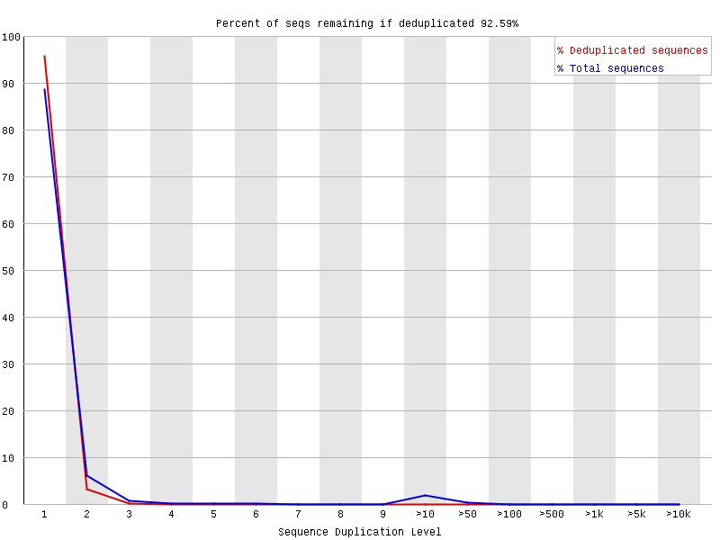

# hse_hw2_chip

**Все задания выполнялись в Google Claboratory:**

[Основная часть](https://colab.research.google.com/drive/1sKNk2RKphO2Uzwe9n0nMSuCRYak30Lqo?usp=sharing)

[Бонус](https://colab.research.google.com/drive/1Gis59LFwvmh0mzzqfmPkNfLbZD0vmKOo?usp=sharing)

## Отчеты FastQC

Рассмотрим отчеты, полученные на оригинальных данных.

### Реплика 1 (ENCFF891GXF)

Единственный график в отчете, который подозрителен (имел ворнинг) - это распределение GC, можно увидеть, что распределение неравномерное. Не смотря на это, я не считаю нужной и полезной дополнительную обработку данных для этой реплики. Отчет показал, что качество данных достаточное для работы с ними.

### Реплика 2 (ENCFF170YTR)

С распределением GC явно что-то пошло не так ¯\\\_(ツ)_/¯ Очевидно, что в некоторых последовательностях количество CG зашкаливает, на фоне низкого количества этих нуклеотидов в других. Что примечательно, общее распределение смещено относительно теоритического в сторону меньшего процента (общая доля CG = 47%), но можно видеть сильный пик именно в центре предполагаемого распределения (53%).

Также я рассмотрю другой показатель, отмеченный как непрошедший проверку: перепредставленные последовательности. Ожидаемо, что там возникли проблемы на фоне графика распределения GC.

Длина   | Доля   | Возможный источник
:------:|:------:|:---------------------------------------:
2307249 | 5.232% | TruSeq Adapter, Index 21 (98% over 51bp)
63552   | 0.144% | TruSeq Adapter, Index 21 (98% over 51bp)

Исходя из [этого источника](https://www.bioinformatics.babraham.ac.uk/projects/fastqc/Help/3%20Analysis%20Modules/9%20Overrepresented%20Sequences.html) и других, такая проблема возникает в результате секвенирования и может показать:

1. Важную для реплики последовательность нуклеотидов

2. Загрязненное чтение

Я пришла к выводу, что это адаптер (как и указано в предположенном источнике) и качество реплики не такое высокое, каким могло бы быть. [Обработка](reports/ENCFF170YTR_trimmed_fastqc.html) этой проблемы решить не сможет.

### Контроль (эксперимент ENCSR549SVK, ENCFF524OKJ)

Если в репликах _Per Tile Sequence Quality_ не выделялся совершенно никак, то на контроле заметна неоднородность полей хитмапа, но ничего критичного.

Как и в случае со второй репликой, я рассмотрю другой показатель, отмеченный как непрошедший проверку: перепредставленные последовательности.

Длина   | Доля   | Возможный источник
:------:|:------:|:---------------------------------------:
1902820 | 6.978% | TruSeq Adapter, Index 21 (98% over 51bp)
284634  | 1.044% | TruSeq Adapter, Index 21 (98% over 51bp)
27347   | > 0.1% | TruSeq Adapter, Index 21 (97% over 39bp)

Такая же проблема "загрязнения", вдобавок график распределения CG схож с образцом _YTR_. [Обработка](reports/ENCFF524OKJ_trimmed_fastqc.html) не дала значимых улучшений:

1. Из _Overrepresented sequences_ пропала самая короткая последовательность, но она и так находилась на уровне ворнинга, а не проблемы (~0.1% при допустимом <=1%).

2. график _Per base sequence content_ избавился от ворнинга, но визуально почти не изменился (надо полагать, что для оригинальных данных он переступил порог не так значительно).

Per base sequence content                          | Per base sequence content trimmed
:-------------------------------------------------:|:---------------------------------------------------------:
 | 

### Вывод по отчетам FastQC

Обращаясь к основному графику качества (_Per base sequence quality_). Можно назвать качество отчетов достаточным. Хотя, конечно отличным улучшением было бы избавиться от TruSeq адаптера для второй реплики и контроля (YTR и OKJ, соответственно).

## Выравнивание на Chr13

Реплика/контроль | Всего ридов | Не выравнялись | Выравнялись 1 раз | Выравнялись >1 раза | Общ. коэфф. выр.
:---------------:|:-----------:|:--------------:|:-----------------:|:-------------------:|:---------------:
ENCFF891GXF      | 43936063    | 37341354       | 1554436           | 5040273             | 15.01%
ENCFF170YTR      | 44100884    | 38851211       | 1250566           | 3999107             | 11.90%
ENCFF524OKJ      | 26806318    | 22969638       | 957627            | 2879053             | 14.31%

Реплика 1 [GXF]                  | Реплика 2 [YTR]                    | Контроль [OKJ]
:-------------------------------:|:----------------------------------:|:-------------------------------:
 |    | 

Размер тринадцатой хромосомы составляет 3.5-4% всего материала ДНК человеческой клетки. Уникальные выравнивания варьируются от 2.8 до 3.6 процентов (2.84%, 3.54%, 3.57%). К сожалению, показатели выравнивания не очень хорошо совпрадают с хромосомой, на которую оно выполнялось. Я полагаю, что контроль имеет наилучший результат в силу замеьно меньшего размера, по той же причине вторая реплика имеет худщие показатели (ее длина наибольшая). К этому выводу можно прийти, сравнив абсолютные показатели выравниваний для всех трех образцов.

## Диаграммы Венна

### Реплика 1 [GXF]

### Реплика 2 [YTR]

### Вывод по диаграммам Венна

Результат печальный (T_T) Если на данных для семинара был получен довольно небольшой, но хоть какой-то результат, то здесь пересечения оказались нулевыми (!). Но это можно объяснить тем, что файл для сравнения очень мал. Для улучшения результатов можно изменить параметры ширины и плотности для определения пиков.

## Бонус

----

Можно считать, что эксперимент получился неплохим. Результат достаточно адекватный и соответствует реальным результатам статьи.
